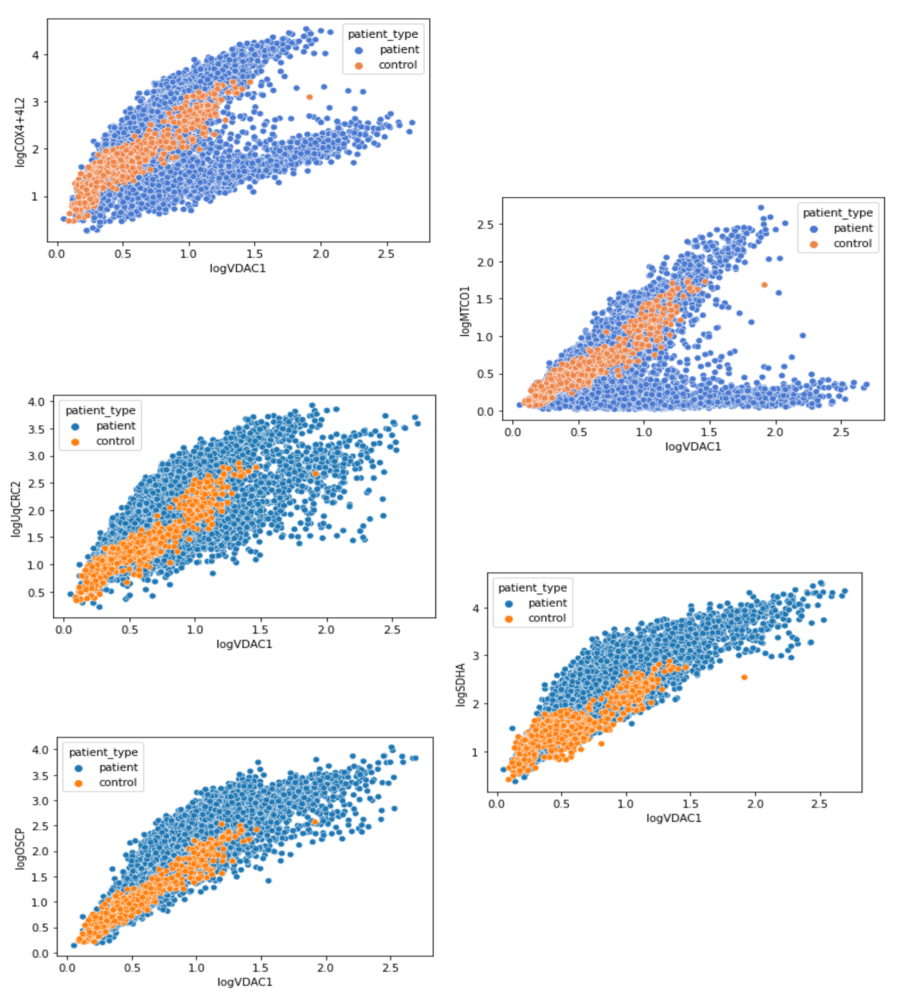
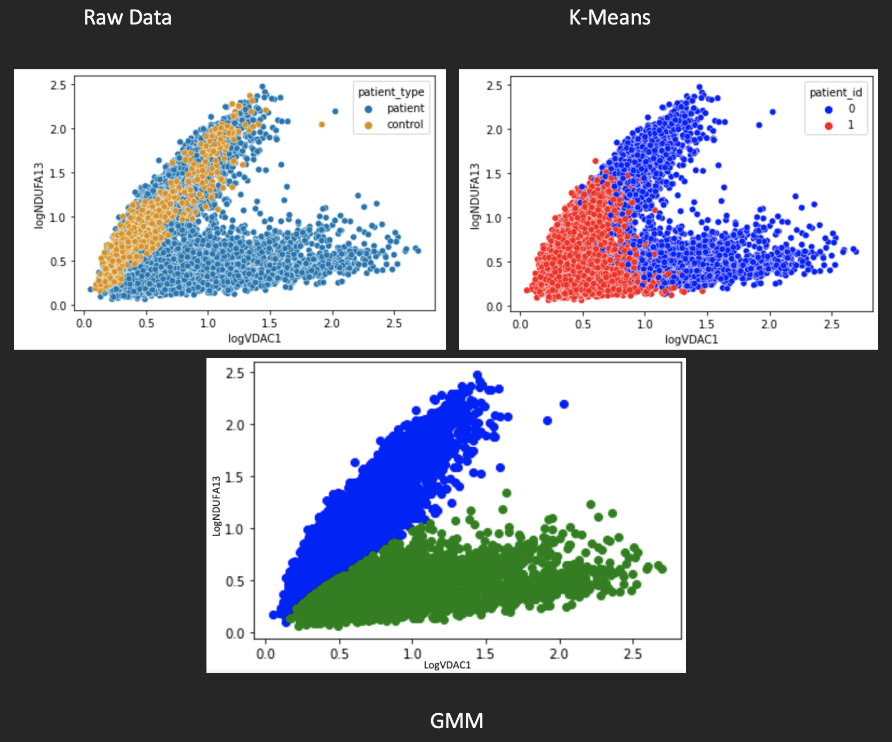
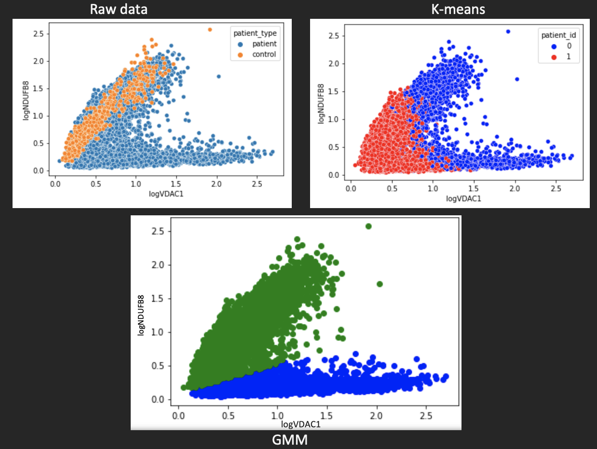
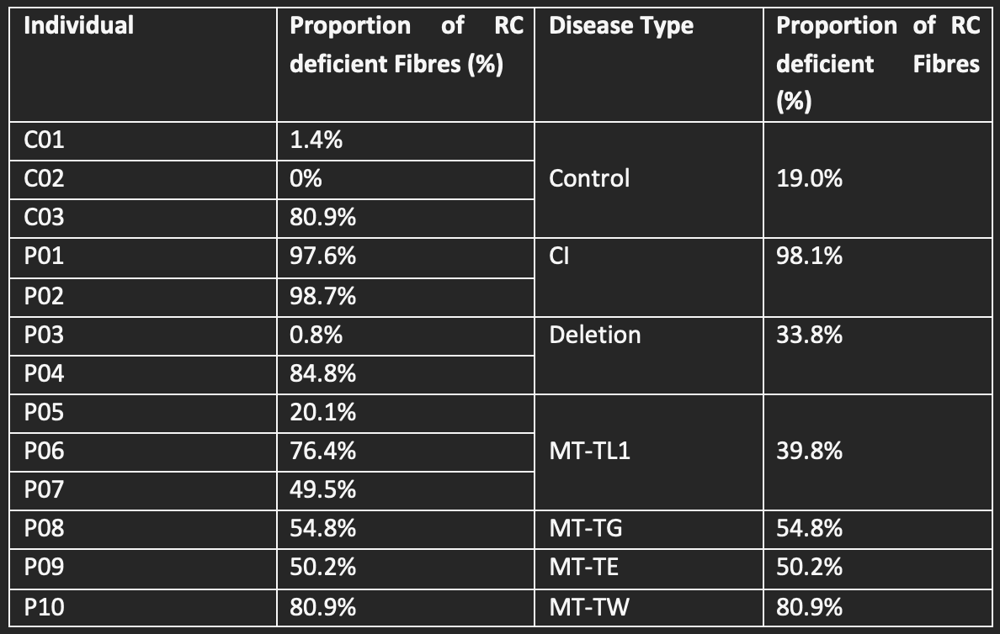
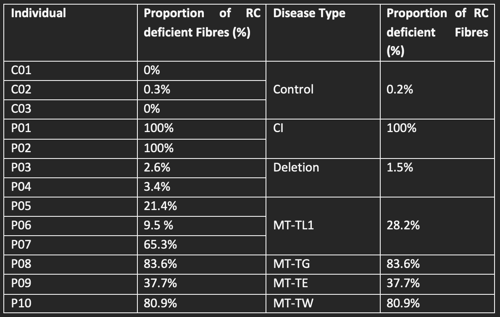
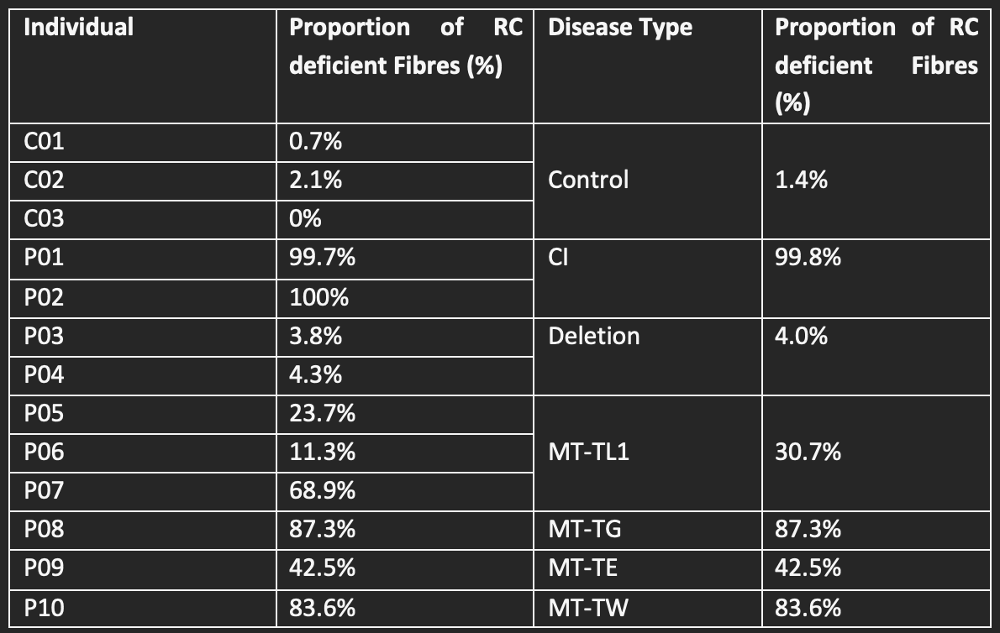

# 
<h1 align="center"> CSC8639 - MSc Data Science  Project and Dissertation </h1>
<h1 align="center"> CLASSIFICATION OF FIBRES FROM THE  MITOCHONRIOAL DISEASE DATASET USING CLUSTERING TECHNIQUES 
</h1>
<h1 align="center"> Author: Frestie Ngongo   Supervisors: Stephen McGough, Amy Vincent, Conor Lawless, Atif Khan </h1>

## 1. Abstract
---
The diagnosis of patients with mitochondrial disease can be prone to human error with studies highlighting that 55% of patients with mitochondrial disease were initially misdiagnosed. This resulted from an insufficiency in understanding and clinical tests for identifying key factors in patients with mitochondrial diseases, to help with diagnosis. Therefore, conducting this research in order to find out if protein intensities could be used as suitable factors was essential, because the heterogenous expression of oxidative phosphorylation proteins is known to be a characteristic finding in mitochondrial disease. For this reason, the proteins ‘NDUFB8 ‘and ‘NDUFA13’, both part of the oxidative phosphorylation process, were analysed using machine learning unsupervised models. Clustering algorithms – K-Means and Gaussian Mixture Model – were used to identify whether these proteins could be used to separate out patient fibres into two groups, those with the reactive–chain deficiency, and those without. This produced plots that showed the Gaussian Mixture Model was better fitted to the data due to producing two clusters, unlike the K-Means model. Additionally, the CI variant of the mitochondrial disease was found to have 100% of patient fibres as reactive-chain deficient, whilst only a small percentage, ~4%, of the patient fibres of those with the deletion variant of mitochondrial disease were predicted as reactive-chain deficient in the Gaussian Mixture Model. This showed that the model may have identified the pattern for each patient and used this to predict their clinical outcome.
## 2. Introduction
---
Mitochondrial dysfunction is identified as a particularly heterogenous pathological change [1]. Mitochondrial diseases have been difficult to diagnose due to the different ways it presents in various individuals, including the many different organs [2]. In addition, there is no single lab or diagnostic test that can be carried out to confirm whether an individual has the disease [2]. Currently, gene analysis is the most reliable method used to confirm mitochondrial disease states in individuals, alongside taking a family history, blood and urine tests, and physical examinations [3]. However, studies have found that 55% of patients with mitochondrial disease were initially misdiagnosed on first admission and of these, 32% were misdiagnosed twice [4]. These figures are alarming and highlight the impact of human error. Introduction of an alternative method of diagnosis could therefore help to solve this issue, i.e., the use of Machine Learning (ML), such as the use of the decision tree classifier and naive Bayesian classifier to analyse medical records. All that needs doing would be to input the patient records with known correct diagnosis into a computer program to run a learning algorithm. This would then produce an output and the accuracy of the algorithm can be checked [5].

The dataset used in this study was obtained from The Welcome Centre for Mitochondrial Disease of which were 3 controls and 9 patients. Imaging Mass Cytometry (IMC) was used to analyse the proteins in these samples. IMC works to analyse up to 40 protein markers simultaneously, using metal-labelled antibodies with laser ablation, followed by detection using mass cytometry by time-of-flight [6]. This was used to produce images that were then used to quantify the protein mean intensities. The proteins looked at were NDUFA13, NDUFB8, VDAC1, COX4+4L2, OSCP, MTCO1, SDHA, UqCRC2. The VDAC1 protein is known to be a mitochondrial mass marker and was used as a standard for creating a ratio with the other proteins [7]. Information regarding the 8 different proteins within the sample, the myofibers locations, the area of the myofibers, cell circularity and perimeter were obtained, and results presented in a table. The focus was how the protein mean intensities affected the categorisation of the fibres. This is because the proteins were more realistic factors that could contribute to the diagnosis of whether an individual had the mitochondrial disease (patient) or they did not (control).

The use of Machine Learning Algorithms may help to analyse these proteins and determine whether they are useful markers for diagnosis of mitochondrial diseases. For example, a study looked at developing three ML predictive models for cancer diagnosis and managed to achieve a maximum accuracy of 96% using the support vector machines algorithm [7]. This was used to separate the data into two groups - those with cancer and those without. Applying this knowledge, the use of ML may be used to categorise the fibres of the individuals in this study into those with a reactive chain (RC) deficiency and those without. RC deficiency is a characteristic of those with the mitochondrial disease and the proteins NDUFB8 and NDUFA13 are known as NADH:ubiquinone oxidoreductase subunit B8 and A13 respectively. They function in the transfer of electrons from NADH to the respiratory chain, therefore an abnormality in the numbers of these proteins present may cause a break in the oxidative phosphorylation process, hence reducing the amount of energy produced for the proper functioning of the cell. For this reason, the NDUFB8 and NDUFA13 proteins were focussed on in this project.

Machine Learning as a branch of Artificial Intelligence and Computer Science uses algorithms to imitate the way humans learn, while gradually improving its accuracy [8]. Being able to predict whether an individual has the mitochondria disease or not and going further to identify what variation of the disease they may have, is important, but being able to do so accurately is even more essential. Therefore, running algorithms, including clustering algorithms, on the dataset, and analysing their accuracy and precision could potentially provide a means to make the diagnosis of mitochondrial diseases easier and accurate, due to pattern recognition, and less human errors.

The aim of this project is to design a model to accurately classify fibres into one of two groups: healthy or RC deficient. Then going further to classify those with mitochondrial disease into one of six groups, those with the mitochondrial disease and those without. This will involve carrying out two clustering algorithms to identify whether either of one of them is able to produce two clusters: one for each classification.

## 3. Background and Relevant Work
---
There are four types of machine learning: supervised learning (SL); unsupervised learning (UL), semi-supervised learning (SSL), reinforcement learning (RL). For SL models, input and output data are fed into the algorithm, whilst for UL models, they independently identify patterns in the input data and use this to predict an output. In SSL algorithms, they can use a mix of classified and unclassified data to build problem-solving models. For RL models, they make use of a rewards system, in that the algorithms get rewarded for desired actions and punished for undesired actions. The clustering algorithms used in this project make use of unsupervised learning. This is ideal as the model can predict what category to place the fibres into based on patterns identified, hence aiding to see how accurately the model can be used in diagnosis of mitochondrial diseases [9].

A study conducted by Warren. C et al., looking at the decoding of mitochondrial heterogeneity in single muscle fibres using imaging mass cytometry (IMC), formed the foundation of this project. [7] IMC makes use of the antibody-conjugated isotopes of rare earth metals with laser ablation, and detection using mass cytometry by time-of-flight [6]. It analyses up to 40 protein markers simultaneously to create images of high definition from a single tissue section [6]. This produced the dataset used for the study by Warren. C et al., and the same dataset used in this project. The result of the study by Warren. C et al., was that they were able to demonstrate the accurate quantification of protein levels using IMC. From this they accurately measured the deficiency of oxidative phosphorylation for common mitochondrial DNA variants and witnessed a compensatory upregulation in the number of unaffected oxidative phosphorylation components [7]. This led to the construction of this project, to identify whether either of the NDUFB8 and NDUFA13 proteins contributed to the deficiency in oxidative phosphorylation witnessed, because the heterogenous expression of oxidative phosphorylation proteins, and resulting respiratory deficiency, are characteristics found in fibres with a mitochondrial dysfunction.

A recent trial had made use of machine learning algorithms (namely the SL models) to predict those that fall into the at-risk category for COVID-19 in a timely manner, hence reducing death rates [10]. In this study, they identified 20 features they deemed as significant for predicting the survival chance of an individual and ran this against SL models (logistic regression, random forest, and extreme gradient boosting) [10]. The outcome of the study was that the random forest model outperformed the others. The study conducted by Sumayh S. Aljameel et al., was similar to the one carried out in this research, in that specific features were used to predict one thing or the other. 

Alternatively, another study by Hany Alashwal et al., used multiple clustering algorithms for partitioning patients of Alzheimer’s disease based on their similarity [11]. They used K-Means clustering to identify whether it could classify individuals into the correct bio-profile. They observed that for those with Alzheimer’s disease, more than 69% of them and about half of those with mild cognitive impairment were always assigned to the pathological bio-bioprofile. This led to the belief that the K-means algorithm could predict datasets with clinical features into specific labels. This prompted the use of clustering algorithms in this research project. Also, the idea that the data passed through the model is unlabelled is beneficial as it means that the model is required to identify its own pattern and predict an outcome. Plus, the article by Hany Alashwal et al., also highlighted that unsupervised learning algorithms have been proven to be powerful for discovering patterns. [11]

## 4. Methods
---
The work carried out in this project involved using the notebook from anaconda using python software to calculate the log of the mean intensities of the proteins and using that value for the rest of the project. The first part of the project included analysing the data using graphs to view the log intensity of the proteins. This was followed by constructing a K-Means clustering algorithm, then a Gaussian Mixture Model (GMM) clustering algorithm.

### 4.1 Exploratory Data Analysis

For the analysis, the raw data, which was in long format, was reshaped to a Y format. This splits the data into key columns in a data frame. From this, the key columns, containing the logs of the proteins, the patient type, cell ID, patient ID, and subject group. Then the log mean intensity of the VDAC1 protein with the log mean intensities of all the other proteins were plotted on a scatter plot in python. The proteins belonging to the patients were coloured in blue and those of the control were coloured in orange.

### 4.2 K-Means

Following on from this, the K-Means clustering algorithm was constructed. This involved setting the number of clusters to 2, as we knew that there were two labels: those with the mitochondrial disease and those without the disease. The data applied to this model included all the 6 proteins. The K-Means was left to use this data to predict a diagnosis of whether the fibre belonged to a patient or a control. The results of this algorithm were presented using two separate scatter plots similar to the raw data comparing the proteins: logNDUFA13 and logNDUFB8 with the logVDAC1 protein. The scatterplot was also coloured in red for the control and blue for the patient to show which fibres the model had predicted to fall into which category.

### 4.3 GMM
A similar method used for the K-Means was applied to the GMM. So, the GMM was used to predict 2 clusters using data consisting of only two proteins at a time; logNDUFB8 with logVDAC1; then logNDUFA13 with logVDAC1. The result of this algorithm was used to create two scatterplots of the logNDUFB8 and logNDUFA13 with the logVDAC1. The plots were coloured in blue for the fibres predicted to be non-RC deficient and in green for the fibres predicted to be RC deficient.

### 4.4 Analysis of Clusters

The results of the K-Means and GMM clustering algorithms were used to create tables consisting of the proportions of fibres predicted to be RC deficient and those predicted to be non-RC deficient. The tables presented these proportions for everyone (both controls and patients), plus the proportions predicted for each disease type.

## 5. Results
---
This project aimed to use clustering algorithms to identify any patterns in the data and to see whether the models could be used to split the data into 2 clusters: those with mitochondrial disease and those without. 

### 5. 1 2D Mito Plot
 
>Figure 1. Plots of 5 different proteins against the LOG_VDAC1 protein.
The plots of 5 different proteins against a sixth protein (logVDAC1), that are found in the individuals’ fibres. The plots identify that the control fibres, in orange, seem to be less spread out than the patients’ fibres, in blue.

The fibres from the IMC were analysed and it was found in the exploratory data analysis (Figure 1) that the data for the patients were very spread out for each protein. However, for the control, the data appeared to be less spread out. For this reason, it was apparent that the patients and control had some differences in the protein compositions. This led to the use of different clustering algorithms to identify whether the proteins were key in labelling an individual as a patient or control.

### 5.2 NDUFA13 

The K-Means and GMM algorithm were ran and produced plots of the outcome based on the NDUFB8 protein.

 
>_Figure 2. Plots of the amounts of logNDUFA13 vs the amounts of logVDAC1 proteins in the raw data, K-Means Model and Gaussian Mixture Model (GMM).
The K-Means algorithm showed no distinct separation in the clusters in comparison to the GMM model, which showed two separate groups. The control group appeared to be in the lower left corner of the graph of the KMeans in red, whilst the results for patients showed them in the higher end of the graph in blue. For GMM, there was a clear separation with an observation of 2 distinct clusters forming the ‘V’ shape: control in blue, patients in green._
	

It was observed that the GMM model produced a better prediction than the K-Means graph to classify the fibres, as it produced two clusters. The next step was to see if the same was true for the NDUFB8 protein.

### 5.3 NDUFB8

The K-Means and GMM algorithm were ran and produced plots of the outcome based on the NDUFB8 protein.

 
>_Figure 3. Plots of the amounts of NDUFB8 vs the amounts of LOG_VDAC1 proteins in the raw data, K-Means Model and Gaussian Mixture Model (GMM).
The K-Means produced a plot with no clear separation of the 2 clusters. The GMM cluster was observed to have produced 2 clear clusters, control in green, patients in blue. However, of those predicted to be control in the GMM plot, some were identified as patients in the raw data._

NDUFA13 and NDUFB8 proteins were focussed on in this project. Both of these proteins appear to separate the data into two clusters in the GMM however, this is not the case for the K-Means model. The NDUFA13 and NDUFB8 proteins are known as NADH:ubiquinone oxidoreductase subunit A13 and B8 respectively. They function in the transfer of electrons from NADH to the respiratory chain. Both NDUFA13 and NDUFB8 play a significant role in oxidative phosphorylation as the NADH is important in the process of phosphorylating a molecule called ADP into ATP, which is a good store of energy. Based on the results observed, it appeared that both proteins played vital roles in the classification of whether a fibre belonged to a patient or control, according to the GMM. The KMeans graphs, on the other hand, did not show any clear split in the data, hence it was predicted that the K-Means algorithm could not be used for this set of data to predict a label for the fibres.

Following on from this, the proportion of fibres predicted to be RC deficient was produced to identify if there were any trends in the data.

## 5.4 K-Mean results
---
 
>_Table 1. Proportion of Reactive Chain (RC) Deficient Fibres in each patient and in each disease from the K-Means Result.
The tables shows that controls 1 and 2 were predicted to have a low to zero proportion of reactive chain (RC) deficient fibres, whilst for control 3, they were predicted to have a high percentage of RC deficient fibres. Patients 1 and 2, who have the CI disease variation, were predicted to have almost 100% RC deficient fibres. This was followed by those with the MT-TW disease variant, who were predicted to have around 80% of their fibres as deficient. Patients 3 and 4, although they had the same disease, the algorithm predicted them to have differing amounts of RC deficient fibres. Likewise, the same was true for patients 5, 6 and 7. Those with MT-TG and MT-TE mutations had almost 50% RC deficient fibres and 50% healthy fibres._

Table 1, which was produced from the K-Means algorithm, predicted that for the control fibres, a large percentage of 19% of the fibres were RC deficient. This was mainly from the prediction for control 3. The K-Means algorithm had predicted 80.9% of control 3 and 1.4% of control 1’s fibres to be RC deficient fibres. Compared to the two tables for GMM, which both predicted the RC deficient fibres to be <1.5% for the control patients, the K-Means algorithm was observed to perform poorly for the control data.

## 5.5 GMM Table of Results part 1:  LogVDAC1 & LogNDUFA13
---

 
>_Table 2. Proportion of Reactive Chain (RC) Deficient Fibres in each patient and in each disease from the GMM Result.
The GMM model was ran using only the logNDUFA13 and logVDAC1 proteins and produced almost 0% of the controls as having RC deficient fibres. It also predicted patients 1 and 2 to have 100% RC deficient fibres. This was followed by patient 8 (MT-TG) and patient 10 (MT-TW), who were both predicted to have around 80% of their fibres as RC deficient. The deletion patients (patients 3 and 4) both have a very low proportion of RC deficient fibres, which is ideal considering they have the same disease. Contrary to this, the patients with the MT-TL1 disease were predicted to have varying proportions of deficient fibres._

Analysis of the GMM results from the NDUFB8 protein was also constructed to produce a similar table as in table 2.

## 5.6 GMM Table of Results part 2: LogVDAC1 & LogNDUFB8
---

>_Table 3. Proportion of Reactive Chain (RC) Deficient Fibres in each patient and in each disease from the GMM Result. 
The GMM model was ran using only the logNDUFB8 and logVDAC1 proteins and predicted controls 1 and 2 to have a low proportion of RC deficient fibres. It also predicted patients 1 and 2 to have close to 100% RC deficient fibres. Patient 8 (MT-TG) and patient 10 (MT-TW) were both predicted to have over 80% of their fibres as RC deficient. The deletion patients were both predicted to have a low amount of RC deficient fibres averaging 4.0%. The patients with the MT-TL1 disease were predicted to have a similar proportion of deficient fibres for patients 5 and 6, but patient 7 was significantly different from the rest._

Tables 1-3 present that, for the CI mitochondrial disease mutation, the proportion of RC deficient fibres were approximately 100%. From this prediction, an assumption could be made that for an individual to be diagnosed with the CI disease mutation, all their fibres would need to be RC deficient. The K-Means table presented differing results for the rest of the mutations in comparison to the GMM. It predicted that 1/3 of the fibres of those with the deletion mutation was RC deficient, whilst also predicting patients 3 and 4 to have significantly different compositions of fibres. This reinforces the unreliability of the K-Means algorithm on this dataset. The GMM tables (tables 2-3), however, presented deletion to have less than 5% of the fibres as RC deficient and instead predicted MT-TL1 to have around 1/3 of the fibres as RC deficient. For GMM, MT-TG and MT-TW were predicted to have similar percentages of RC deficient fibres according to tables 2-3, however, table 1 shows MT-TG and MT-TE having a similar RC deficient fibre proportion. K-Means had predicted MT-TG and MT-TE with 50% of their fibres as deficient and 50% has healthy. Both models predicted MT-TW as having 80.9% of its fibres as deficient. From both models, it was observed that the percentage of RC deficient fibres for CI, MT-TL1 and MT-TW remained slightly consistent at approximately 100%, 35% and 80% respectively. Although the algorithms predicted different results for the other proteins, it was still obvious that besides CI, it was not necessary for all the different variants to have 100% RC deficient fibres to be diagnosed with the disease.
## 6. Conclusion
---
The GMM and K-Means clusters were successfully applied to the mitochondrial dataset and seemingly produced differing outcomes. The two algorithms both produced evidence that there were patterns in the NDUFB8 and NDUFA13 proteins that aided in the classification of an individual as having fibres which were RC deficient and non-RC deficient, due to the two clusters witnessed in the GMM plot, and the differing positioning of the control and patient fibres in the K-Means plot. These clustering algorithms were also used to identify the proportions of RC deficient fibres and found that for MT-TL1, other variables may play bigger roles in deciding whether the individual is diagnosed with the disease or not. This was because patients 5, 6 and 7, all known to have the MT-TL1 disease, were predicted to have varying proportions of the RC deficient fibres. However, for the CI and MT-TW diseases, the clustering algorithms had a consistent prediction of the proportions of the RC deficient fibres. Therefore, it could be concluded that the algorithms may be helpful to predict an individual as having the CI and MT-TW disease based on the NDUFB8 and NDUFA13 proteins but could less likely be accurate in predicting whether an individual had the MT-TL1 variant. Furthermore, it was observed that those with the deletion mutation had very low amounts of RC-deficient fibres. This characteristic highlighted that not all fibres in an individual with the deletion variant of the mitochondrial disease were defective in terms of protein proportions.

## 7. Contribution to the States of the Art
---

This work contributes to ongoing work to aid in an understanding that the NDUFB8 and NDUFA13 proteins are likely to play significant roles in the diagnosis of an individual into a specific type of mitochondrial disease. It can assist with research carried out by the mitochondrial research institute, highlighting the use of clustering algorithms to make useful predictions, showing that there are likely patterns in the mean protein intensities. Additionally, it has the potential to aid in the process of diagnosing an individual as having the mitochondrial disease or not and specifying which variant they have, which would help to reduce human error and reduce misdiagnosis. 

## 8. Scope and Limits of the Work and Future Work
---
For future work, it might be good to see if there is a way to differentiate between MT-TG and MT-TW disease types considering the NDUFA13 and NDUFB8 proteins predicted them to have similar proportions as shown in the GMM results table.
Additionally, looking at MT-TL1, each patient in that same category had varying proportions of RC deficient fibres for the two algorithms. It would be interesting to take this study further to identify what other attributes could influence the classification of an individual into this category considering their varying protein contents. This might include looking into another protein such as MTCO1 or looking at amounts of lactate present. 

## References
---
1.	Alston, Charlotte L et al. “The genetics and pathology of mitochondrial disease.” The Journal of pathology vol. 241,2 (2017): 236-250. doi:10.1002/path.4809
2.	Koenig, Mary Kay. “Presentation and diagnosis of mitochondrial disorders in children.” Pediatric neurology vol. 38,5 (2008): 305-13. doi:10.1016/j.pediatrneurol.2007.12.001
3.	Cleveland Clinic. 2021. Mitochondrial Diseases: Causes, Symptoms, Diagnosis & Treatment. [online] Available at: <https://my.clevelandclinic.org/health/diseases/15612-mitochondrial-diseases>
4.	Columbia University's Mailman School of Public Health. "Mitochondrial disease patients face difficult road to diagnosis: On average, patients see more than eight physicians, undergo multiple tests, and receive misdiagnoses before finally being diagnosed with a mitochondrial disease." ScienceDaily. ScienceDaily, 26 March 2018. <www.sciencedaily.com/releases/2018/03/180326161004.htm>.
5.	Kononenko I. Machine learning for medical diagnosis: history, state of the art and perspective. Artificial Intelligence in Medicine. 2001;23(1):89-109. 
6.	Veenstra J, Dimitrion P, Yao Y, Zhou L, Ozog D, Mi Q. Research Techniques Made Simple: Use of Imaging Mass Cytometry for Dermatological Research and Clinical Applications. Journal of Investigative Dermatology. 2021;141(4):705-712.e1. 
7.	Warren, C., McDonald, D., Capaldi, R. et al. Decoding mitochondrial heterogeneity in single muscle fibres by imaging mass cytometry. Sci Rep 10, 15336 (2020). https://doi.org/10.1038/s41598-020-70885-3
8.	Education, I., 2021. What is Machine Learning?. [online] Ibm.com. Available at: <https://www.ibm.com/cloud/learn/machine-learning>
9.	Patel, Yash. Machine Learning in HealthCare. ResearchGate. 2021
10.	Sumayh S. Aljameel, Irfan Ullah Khan, Nida Aslam, Malak Aljabri, Eman S. Alsulmi, "Machine Learning-Based Model to Predict the Disease Severity and Outcome in COVID-19 Patients", Scientific Programming, vol. 2021, Article ID 5587188, 10 pages, 2021. https://doi.org/10.1155/2021/5587188
11.	Alashwal H, El Halaby M, Crouse J, Abdalla A, Moustafa A. The Application of Unsupervised Clustering Methods to Alzheimer’s Disease. Frontiers in Computational Neuroscience. 2019;13.

| Name       |  Email              | LinkedIn          | GitHub            |YouTube Chanel                   |
|------------|---------------------|-------------------|-------------------|-------------------|
| Frestie    |  f.ngongo2@ncl.ac.uk|[Frestie Ngongo](http://linkedin.com/in/frestie-ngongo-916781122)|          [FNgongo](https://github.com/FNgongo/MScDissertationLeighSyndrome/blob/main/EDAandBasicML-FNVesion-Copy1.ipynb)|[Frestie Ngongo](https://www.youtube.com/channel/UCxy6Qlb5YlQz2-w6e3metCg)|   |                   |

